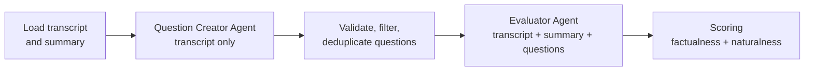

# QA Eval Presentation

Metrics in this deck come from `data/evaluation_report.json` and `data/question_filter_report.json`.

## Slide 1 - QA Eval Review

**Title**

`QA Eval Review: Rational Reminder Summary Assessment`

**Content**

- Evaluate how well the summary preserved information from the source transcript.
- Source material: Rational Reminder podcast episode 299.
- Main focus: factual retention and naturalness retention.

**What to discuss**

- This was not just a readability check.
- The goal was to measure how much information the summary kept versus how much it lost.

## Slide 2 - Evaluation Setup

**Title**

`What We Evaluated`

**Content**

- Questions were generated from the transcript only.
- Requested question volume: 200 `factualness` and 200 `naturalness`.
- Final evaluated set: 407 questions.

**What to discuss**

- Using transcript-only question generation keeps the benchmark independent from the summary.
- This makes the evaluation more reliable because the candidate summary does not influence the rubric.

## Slide 3 - QA Eval Workflow

**Title**

`How The QA Eval Worked`

**Content**

**What to discuss**

- The question creator agent builds the benchmark from the transcript only.
- The evaluator agent checks whether the summary preserves each surviving signal.
- Scoring converts the evaluator answers into factualness and naturalness results.

## Slide 4 - Run Quality

**Title**

`Run Quality And Reliability`

**Content**

- 410 questions parsed.
- 407 final questions kept.
- 0 invalid questions.
- 0 off-rubric questions.
- 3 exact duplicates removed.
- 0 invalid or missing evaluator answers.

**What to discuss**

- The run was clean, so the result mostly reflects summary quality rather than pipeline noise.
- Semantic deduplication was disabled in this run, so some near-duplicate themes may still be present.

## Slide 5 - Headline Results

**Title**

`Overall Results`

**Content**

- Global score: `57.2%` (`233 / 407`).
- Factualness score: `28.5%` (`59 / 207`).
- Naturalness score: `87.0%` (`174 / 200`).

**What to discuss**

- The summary performed strongly on tone, flow, and readability.
- The main weakness was factual preservation.
- The biggest takeaway is that the summary sounds good, but it leaves out a large amount of detail.

## Slide 6 - What Worked Well

**Title**

`Strengths In The Summary`

**Content**

- Preserved the overall episode framing and host dynamic.
- Captured the core theme of the 20 investing lessons.
- Kept several major lesson ideas.
- Maintained a conversational and confident tone.
- Preserved humor and rapport across speakers.

**What to discuss**

- Examples of preserved signals included the episode number, the Twitter and community input, and several early lesson points.
- The summary did a good job staying readable and sounding like a natural recap rather than a dry list.

## Slide 7 - What Was Missed

**Title**

`Main Gaps`

**Content**

- Many specific factual details were dropped.
- Named entities and speaker-linked details were often missing.
- Supporting evidence and qualifiers were reduced.
- Some after-show specifics were not retained.
- Fine-grained pacing and transition cues were weaker.

**What to discuss**

- Example misses included Cameron Passmore identification, regional associations, PWL details, and multiple concrete supporting examples.
- This suggests the summary compressed aggressively and favored readability over detail coverage.

## Slide 8 - Interpretation

**Title**

`What The Scores Mean`

**Content**

- This summary works better as a readable recap than as a high-fidelity reference.
- Naturalness stayed strong even when factual recall dropped.
- The current version is useful for general understanding, but not for detailed recall.

**What to discuss**

- If the use case is audience-friendly summarization, the result is partially successful.
- If the use case is accurate knowledge retention, the summary needs another revision pass.

## Slide 9 - Next Steps

**Title**

`Recommended Next Steps`

**Content**

- Add more named entities, examples, and supporting evidence.
- Preserve more speaker-specific details and qualifiers.
- Re-run the QA Eval after revising the summary.
- Compare the next run against this baseline.

**What to discuss**

- The target for the next iteration should be to raise factualness significantly while keeping naturalness close to the current level.
- A useful follow-up is to enable semantic deduplication and compare the results with human judgment for calibration.
